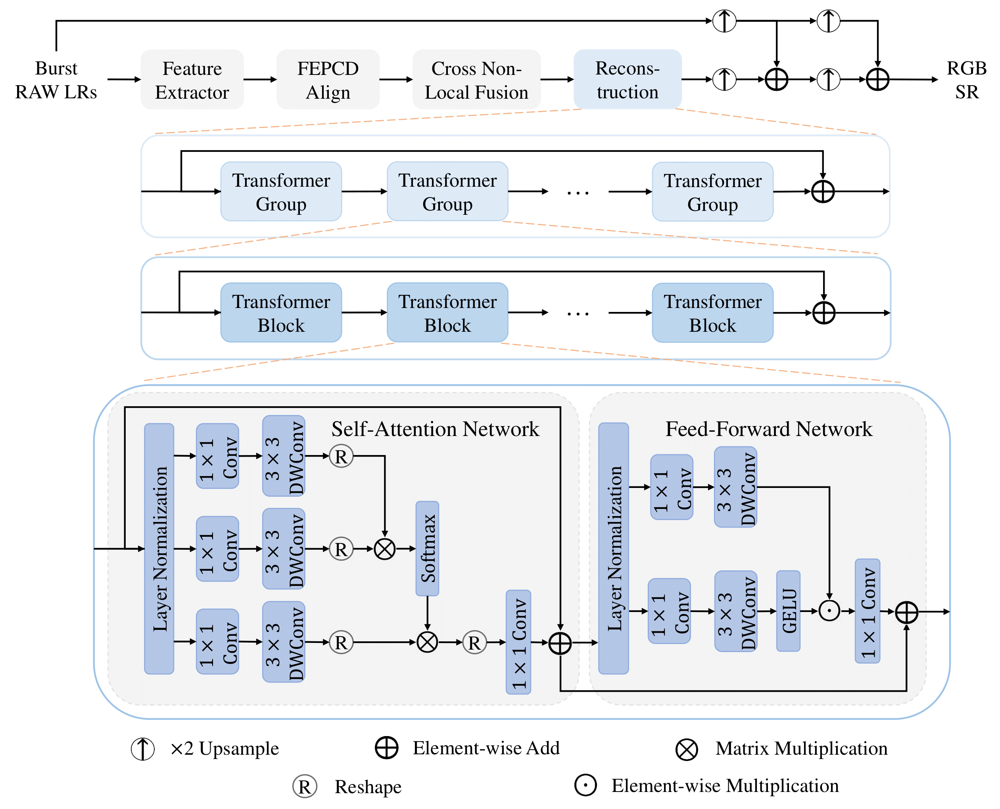

# Transformer for Burst Image Super-Resolution (TBSR)

This is the official PyTorch implementation of TBSR. 

Our Team received 2nd place (real data track) and 3rd place (synthetic track) in [**NTIRE 2022 Burst Super-Resolution Challenge**](https://openaccess.thecvf.com/content/CVPR2022W/NTIRE/papers/Bhat_NTIRE_2022_Burst_Super-Resolution_Challenge_CVPRW_2022_paper.pdf) (CVPRW 2022).

Please see more detailed descriptions of TBSR from [`TBSR.pdf`](TBSR.pdf).

## 1. Framework

Overview of the network architecture for TBSR.

## 2. Preparation

- **Prerequisites**
    - Python 3.x and PyTorch 1.6.
    - OpenCV, NumPy, Pillow, CuPy, tqdm, lpips, scikit-image and tensorboardX.

- **Dataset**
    - Please see this [competition description](https://github.com/goutamgmb/NTIRE22_BURSTSR) for the download and use of datasets.
       
## 3. Quick Start

- **Training**

    - For track 1, modify `dataroot` in `sh train_track1.sh` and then run:

        [`sh train_track1.sh`](train_track1.sh)

    - For track 2, modify `dataroot` in `sh train_track2.sh` and then run:
        
        [`sh train_track2.sh`](train_track2.sh)

- **Testing**

    - The [pre-trained models](https://drive.google.com/drive/folders/1RKoJaXMFyzP9832_OIEnOU_EJUvEbRuP?usp=sharing) can be downloaded. You need to put the two folders in the `./ckpt/` folder.

    - For track 1, modify `dataroot` in `sh test_track1.sh` and then run:

        [`sh test_track1.sh`](test_track1.sh)

    - For track 2, modify `dataroot` in `sh test_track2.sh` and then run:
        
        [`sh test_track2.sh`](test_track2.sh)

- **Note**

    - You can specify which GPU to use by `--gpu_ids`, e.g., `--gpu_ids 0,1`, `--gpu_ids 3`, `--gpu_ids -1` (for CPU mode). In the default setting, all GPUs are used.
    - You can refer to [options](./options/base_options.py) for more arguments.

